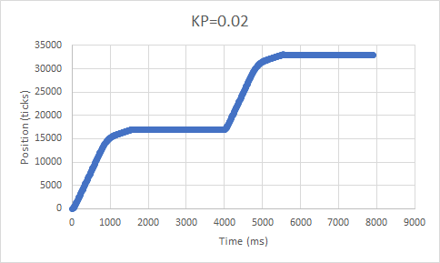
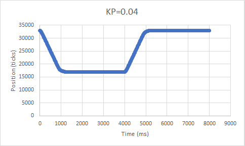
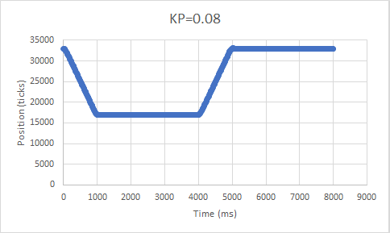

# Lab2

After instantiating the servo, it updates it's Kp value from the input.

It then tells the servo to go to halfway (17,000 encoder tics) and gives it
about 4 seconds to do so. 

To determine how fast to turn the motor, it first determines the number of tics between
its current position and its target value. Based on this error value, it maps it to a 
duty cycle from -100 to 100. The duty cycle is then sent to the motor driver to spin it
at that power.

This process is repeated every 10ms until the 4 seconds is over. 

The next target is 33,000 tics to make it take a full revolution, and the process to 
getting there is the same as before. 

This entire process can be repeated for multiple Kp values if provided more than one.

Here are some examples:

